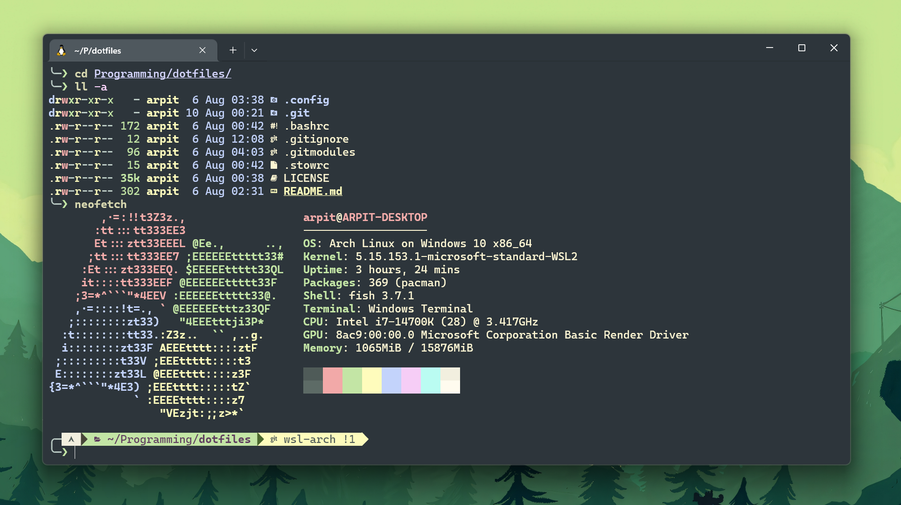

<h3 align="center">
	<br/>
	
	Everforest for <a href="https://github.com/fish-shell/fish-shell">fish-shell</a>
	
</h3>

<p align="center">
  
</p>

## Installation

Install with a plugin manager (see below) or manually by placing Everforest.theme [`themes/`](./themes/) under `~/.config/fish/themes/`.

- [Fisher](https://github.com/jorgebucaran/fisher)

```sh
fisher install Arpitpandey992/fish-everforest
```

- [Oh My Fish](https://github.com/oh-my-fish/oh-my-fish)

```sh
omf install https://github.com/Arpitpandey992/fish-everforest
```

## Usage

Set the theme using

```sh
fish_config theme save "Everforest"
```
